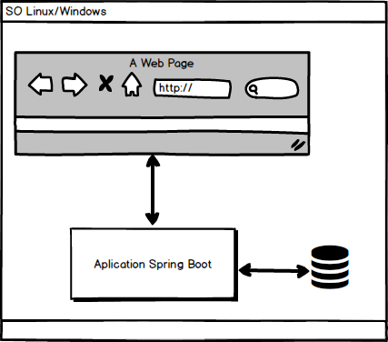
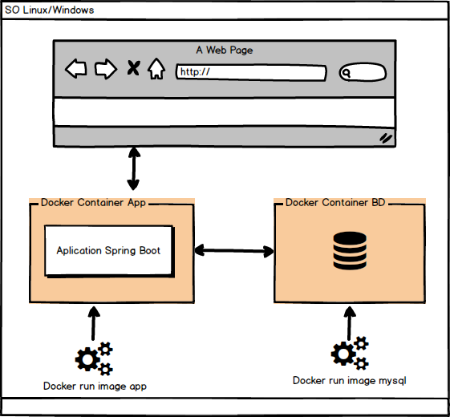
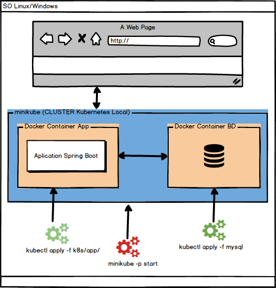

# java-kubernetes-local
Projeto de construção de um ambiente Kubernetes (usando container Docker) para rodar aplicações web, utilizando o Minikube. O Minikube é um utilitário usado para executar Kubernetes (k8s) na máquina local, ele prove todos os recursos necessários para a criação do ambiente kubernetes. Será feito a geração da imagem da aplicação e seu deploy no cluster (kubernetes) com uso de arquivos descritores, bem como da imagem do banco de dados, e as configurações da aplicação Spring boot no intelliJ, para fazer debug com a aplicação rodando no Kubernetes.

# Stack
- Java 15
- IntelliJ 11.09.1
- Docker 19.03.8  
- Mysql 5.6  
- Maven 3.5.4
- MiniKube v1.19.0
- kubectl v1.21.0
- Spring boot 3.2.1 
    - data rest
    - validation 
    - jpa
    - actuator
    - test
 - Prometheus (metricas)
 - Stern (logs)
 
Nota: Para detalhes como versão e dependências, ver arquivo pom.xml do projeto.

# Requisitos 
- SO Linux/Windows
- 2 CPUs ou mais
- 2 GB de memória livre
- 20 GB de espaço livre em disco
- Conexão de internet

# Estrutura do projeto

- k8s
  - app
  - mysql  
- src
    - main
        - java
            - config
            - controller
            - domain
            - persistence
            - service
        - resources
        
    - test
        -java

# Arquitetura da aplicação sem Docker

Aplicação e BD rodando sem container

#  Compilando a aplicação
<pre>maven clean install</pre>

# Executando a aplicação
<pre>java --enable-preview -jar target/java-kubernetes.jar</pre>

# Acessando a aplicação

http://localhost:8080/app/users

http://localhost:8080/app/hello

# Dockerizando a aplicação

### Definição da imagem docker do projeto
Criando arquivo "Dockerfile", que contém as definições de criação da 
imagem da aplicação, esse arquivo fica na raiz do projeto,
seu conteúdo diz:

- Crie uma imagem docker

- Use a imagem da versao do Java openjdk:15-alpine no docker

- Crie a pasta /usr/myapp

- Copie a aplicação compilada para a pasta criada acima

- Use a pasta criada acima, como diretorio de trabalho

- Libere a porta 8080 para a acesso a aplicação

- Execute a aplicação

### Conteúdo do Dockerfile

<pre>
FROM openjdk:15-alpine

RUN mkdir /usr/myapp

COPY target/java-kubernetes.jar /usr/myapp/app.jar
WORKDIR /usr/myapp

EXPOSE 8080

ENTRYPOINT [ "sh", "-c", "java --enable-preview $JAVA_OPTS -jar app.jar" ]
</pre>

### Criando imagem Docker da aplicação

Na pasta da aplicação após criar o Dockerfile executar o comando abaixo,
Que força a criação da imagem, se a imagem existir remova, e
crie a imagem com o nome java-k8s, com todo conteúdo da pasta atual. 

<pre>docker build --force-rm -t java-k8s .</pre>

### Rodando uma imagem docker do BD Mysql

<pre>docker run --name mysql57 -p 3306:3306 -e MYSQL_ROOT_PASSWORD=123456 -e MYSQL_USER=java -e MYSQL_PASSWORD=1234 -e MYSQL_DATABASE=k8s_java -d mysql/mysql-server:5.7</pre>

### Rodando a imagem da aplicação, linkada com a imagem do BD Mysql  

<pre>docker run --name myapp -p 8080:8080 -d -e DATABASE_SERVER_NAME=mysql57 --link mysql57:mysql57 java-k8s:latest</pre>

# Aplicação e BD Dockerizados

Aplicação e BD rodando em containers Docker sem o kubernetes

# Rodando o Minikube (Kubernetes Local)

#### startando o mikube( kubernete local)
<pre>minikube -p dev.to start --cpus 2 --memory=4096</pre>

### Inserindo addons "ingress" no minikube

O ingress serve para expor os serviços rodando, nos pods na rede externa ao minikube

exe: my-domain -> ingress -> SVC-1 -> POD-1
                           \-> SVC-2 -> POD-2

<pre>minikube -p dev.to addons enable ingress</pre>

### inserindo addons "metric-server" no minikube
<pre>minikube -p dev.to addons enable metrics-server</pre>

### Criando o namespace da aplicacao dev-to no minikube

O namespace dev-to fica separado do cluster (kube-system) padrao

<pre>kubectl create namespace dev-to</pre>

# Ambiente Kubernetes Local (Minikube)

Aplicação e BD rodando no Kubernetes Local (minikube)

### Startando o mikube( kubernete local)
A maquina virtual do kubernets, irá usar duas cpus e 4GB de memória

<pre>minikube -p dev.to start --cpus 2 --memory=4096</pre>

### Criando o namespace dev-to no minikube para aplicacao
 O namespace dev-to esta separadoo do cluster (kube-system) padrão
 <pre>kubectl create namespace dev-to</pre>
 
### Visualizando namespaces criados no minikube
<pre>kubectl get namespaces --show-labels</pre>
 
### Inserindo addons "ingress" no minikube
O ingress expõem os container como serviços rodando na rede (pods na rede externa ao minikube)

exe: my-domain -> ingress -> SVC-1 -> POD-1

<pre>minikube -p dev.to addons enable ingress</pre>

### Inserindo addons "metric-server" no minikube
<pre>minikube -p dev.to addons enable metrics-server</pre>

# Gerando e enviando a imagem da aplicação para o minikube
- O comando abaixo também funciona usando git bash (windows)

<pre>eval $(minikube -p dev.to docker-env) && docker build --force-rm -t java-k8s .</pre>

# Deploy no Kubernets
As aplicações e serviços criados devem ser enviadas para dentro do kubernetes (deploy), isso é feito com uso de
arquivos descritores, que definem as configurações da aplicação como Pods e Replicas Sets, a serem criados automaticamente dentro do kubernetes. 

Na pasta "k8s/mysql" da aplicação contém o arquivo: mysql-deployment.yaml - que cria um pod, definindo o container do mysql com: nome da imagem,variaveis de ambiente para senhas, portas, etc.. e o arquivo: mysql-service.yaml que define o POD que ira atuar como um serviço disponivel dentro da rede local.

# Deploy do Banco Mysql para o kubernetes

<pre>kubectl apply -f k8s/mysql/</pre>

### Deploy da aplicação para o kubernetes 

<pre>kubectl apply -f k8s/app/</pre>

### Visualizando PODs
Um pod é um grupo de um ou mais contêineres, com armazenamento compartilhado e recursos de rede, é 
uma especificação de como executar os contêineres. 
Visualizando os pods criados no namespace dev-to no Kubernetes, pelos deploys acima

<pre>kubectl get pods -n dev-to</pre>

### Visualizando informações do kubernetes via Dashboard
<pre>minikube -p dev.to dashboard</pre>

### Acessando o container minikube via ssh
<pre>minikube -p dev.to ssh</pre>

### Visualizando serviços sendo executados no minikube
<pre>kubectl get services -n dev-to</pre>

# HELP Minikube (kubernete local)
### Parando a máquina minikube 
<pre>minikube -p dev.to stop</pre>

### Delete a máquina minikube
<pre>minikube -p dev.to stop && minikube -p dev.to delete</pre>

### Visualizando o IP da máquina minikube
<pre>minikube -p dev.to ip</pre>

### Verificando a versão do minikube
<pre>kubectl version</pre>

### Acessando POD no minikube que está rodando o BD
<pre>kubectl exec -it mysql-74bdd6978d-k8f9p bash</pre>

### Acessando o BD no pod com psql
<pre>psql -U user -d mysql-db</pre>

### Copiando imagem para o cache do minikube
<pre>minikube cache add java-k8s:latest</pre>

### Visualizando o cache do minikube
<pre>minikube cache list</pre>

### Acessando a aplicação no Browser
O comando abaixo, criará um tunel, (uma url) para acessar a aplicação que esta rodando no minikube via browser. Se o terminal onde foi executado o comando for windows, a janela fica-ra travada executando o tunel.

<pre>minikube -p dev.to service -n dev-to myapp --url</pre>

# Acessando a aplicação via hosts names
Localização do arquivo hosts:

Linux:
<code> /etc/hosts</code>

Windows: 
<code>C:\Windows\System32\drivers\etc\hosts</code>

Adicionar no file hosts o ip: 127.0.0.1 dev.local 
Nota: No windows, teoricamente deveria ser acessado assim:
ex: 127.0.0.1 dev.local , sem a necessidade de informar a 
porta na url, mas na prática não funciona e mesma deve ser informada
No browser:  <code>http://dev.local:49563/app/hello</code>

Somente linux: Adicionar ip do minikube exibido pelo comando: 

<code>minikube -p dev.to ip<code>
 
Acessar no browser:<code> http://dev.local:49563/app/hello</code>

### Local de criação das maquinas minikube
<pre> drive\Users\user\.minikube\machines\minikube</pre>

# Escalando a aplicação no Kubernetes 
Escalando para 3 replicas a aplicação rodando no namespace dev-to.
O arquivo: app-hpa - define a quantidade de replicas padrão, que a aplicação de rodar no kubernetes

<pre>kubectl -n dev-to scale deployment/myapp --replicas=3</pre>

### Silenciando (pausando) a execuções dos PODs de myapp
<pre>kubectl -n dev-to scale deployment/myapp --replicas=0</pre>

## Visualizando as replicas escaladas(pods) no namespace dev-to
<pre>kubectl get pods -n dev-to</pre>

# Visualização da execução do LoadBalancer no terminal
Execute o comando abaixo non terminal:
<pre>
while true
do curl "http://dev.local:49563/app/hello"
echo
sleep 1
done
</pre>

E no browser ou curl envie requisições para a aplicação em:
<pre>http://dev.local:49563/app/hello</pre>

Podem ser vistas a alternância dos ips das instancias da aplicação executando no kubernetes. 

### Deletando uma instância (pod) do minikube do namespace dev-to
<pre>kubectl delete pod -n dev-to myapp-b46d8cbc5-vrwvg</pre>

### Adicionando um novo usuário na aplicação
Aplicação e banco rodando no minikube

<pre>curl --location --request POST 'http://dev.local:63197/app/users' --header 'Content-Type: application/json' --data-raw '{"name":"new user","birthDate": "2010-10-01"}'</pre>

# Debug da aplicação rodando no kubernetes
Preparando a porta do POD da aplicação, para ser utilizada no debug da aplicação que esta rodando no minikube 

<pre>kubectl port-forward -n=dev-to myapp-b46d8cbc5-tq95q 5005:5005</pre>

# Logs
### Visualizando logs de um POD
<pre>kubectl logs po/webapp-78c4f886f5-wtrl9 </pre>

##  Stern ferramenta de Logs
* [Download do stern](https://github.com/wercker/stern)
* [Instalação Stern](https://github.com/wercker/stern/releases)
* [Asciinema.org](https://asciinema.org/a/263031)

## Centralizando logs com Stern
Centralizando todos os logs dos PODs, que estão rodando no kubernetes em único log
<b>Linux:</b>
<pre>stern -n dev-to myapp </pre>

<b>Windows:</b>
<pre>stern_windows_amd64.exe -n dev-to myapp</pre>

# HELP Docker
Visualizando logs da app em tempo real

<pre>docker logs -f myapp</pre>

# Stop containers docker

<pre>docker stop mysql57 myapp</pre>

# Removendo imagem do docker

<pre>docker rmi idimagemdocker </pre>

# Referências
* [Projeto Original](https://github.com/sandrogiacom/java-kubernetes)
* [Kubernetes](https://kubernetes.io/)
* [Minikube](https://minikube.sigs.k8s.io/docs/start/)
* [MiniKube tutorial](https://kubernetes.io/pt/docs/tutorials/hello-minikube/)
* [Instalação Stern](https://github.com/wercker/stern/releases)
* [Blog GETUP](https://blog.getupcloud.com/minikube-ame-o-ou-deixe-o-dc18fc7cb993)
* [Blog Ahmet](https://ahmet.im/blog/minikube-on-gke/)
